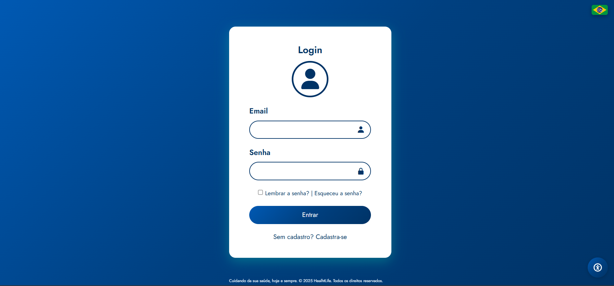
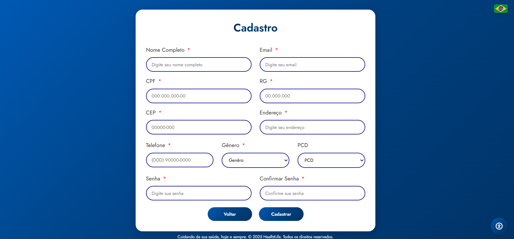
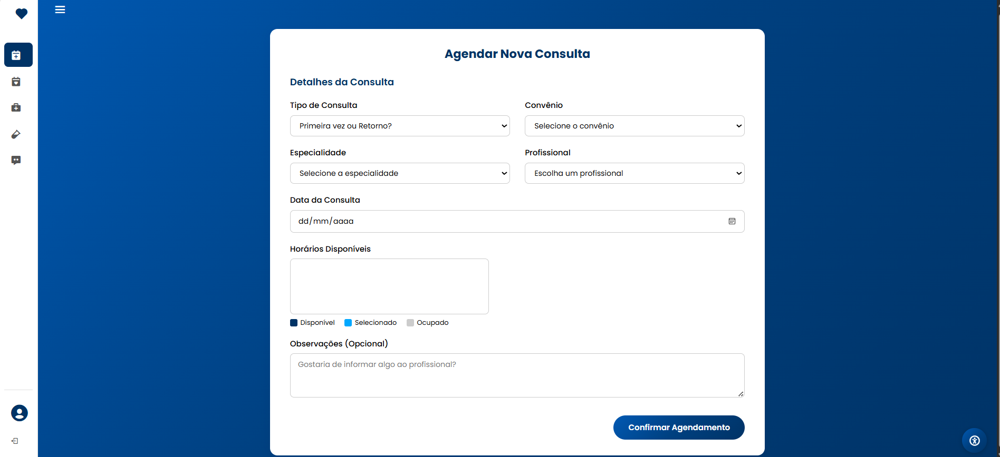

# 🩺 HealhtLife — Sistema de Agendamento de Consultas Médicas

**Projeto desenvolvido como parte da disciplina de Interação Humano-Computador (IHC) no Centro Universitário de Brasília (CEUB).**

<div align="center">
  
  
  
  
</div>

---

## 🧠 Sobre o Projeto

O **HealhtLife** é uma aplicação web moderna e responsiva, criada com foco em **acessibilidade, usabilidade e experiência do usuário**. Seu principal objetivo é permitir que o usuário realize o **agendamento de consultas médicas** de forma simples, eficiente e com interface intuitiva.

---

## 🎯 Funcionalidades

✔️ Formulário de agendamento com:
- Local
- Convênio
- Especialidade médica
- Data e hora

✔️ Layout responsivo e estilizado  
✔️ Ícones interativos e design amigável  
✔️ Menu hambúrguer com opções como "Sair"  
✔️ Código organizado e semântico

---

## 🖼️ Preview Login

<div align="center">
  
</div>

---

## 🖼️ Preview Cadastro

<div align="center">
  
</div>

---

## 🖼️ Preview Agendamento

<div align="center">
  
</div>

---

## 🛠️ Tecnologias Utilizadas

| Recurso         | Função                                       |
|-----------------|----------------------------------------------|
| **HTML5**       | Estruturação da página                       |
| **CSS3**        | Estilização moderna e responsiva             |
| **JavaScript**  | Funcionalidades como o menu e validações     |
| **Google Fonts**| Tipografia personalizada                     |
| **Boxicons**    | Ícones visuais no formulário e no menu       |
| **Font Awesome**| Ícones adicionais para acessibilidade        |

---

## 📁 Estrutura de Pastas

```plaintext
├── componentes        # Fotos do site 
├── css                # Estilização
├── html               # Principal
├── js                 # Funcionalidade
├── cadastro.html      # Página cadastro
├── esqueceuSenha.html # Página esqueceu
├── home.html          # Página principal
├── index.html         # Página login
└── README.md          # Documentação do projeto
```

---

## 💡 Possibilidades Futuras

- [ ] Conectar com backend (PHP, Node.js ou Firebase)  
- [ ] Enviar email de confirmação ao paciente  
- [ ] Armazenar agendamentos em banco de dados  
- [ ] Dashboard para administração  

---

## 🧑‍💻 Desenvolvido por

<div align="left">

**Daniel Campos Coelho**  
Estudante de Ciência da Computação — CEUB
🔗 [LinkedIn](https://www.linkedin.com/in/daniel-coelho-818381293/) 💻 [GitHub](https://github.com/danccoelho)

**Pedro Henrique Postay**

Estudante de Ciência da Computação — CEUB🔗 [LinkedIn](https://www.linkedin.com/in/daniel-coelho-818381293/) 💻 [GitHub](https://github.com/pedrokojiro)
</div>

---

### 💬 Feedback

Tem sugestões ou quer colaborar?  
Abra uma _issue_ ou envie um pull request! 💙

---


